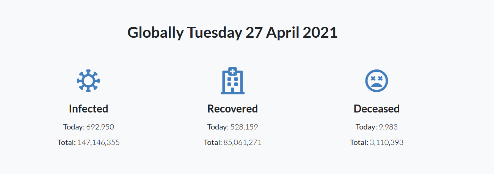
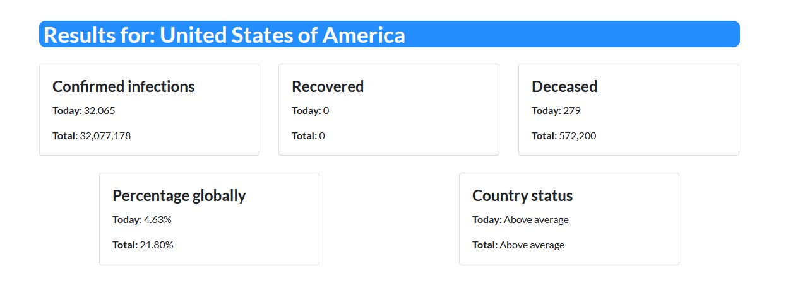

# Covid-lookup
A free to use Python-based Covid-19 stats web interface.

## Prerequisites
* [Python3](https://www.python.org/downloads/ "Download Python") (Python 3.7 - 3.9 has been tested)

## Usage
* Windows: Run the covidlookup.exe executable in the root folder, the executable holds all of the code, so you can copy it outside of the folder without getting any errors.

* If you are using Linux run the following:
```
python3 covidlookup.py
```

## Search bar


## General statistics


## Specific statistics


## Charts

